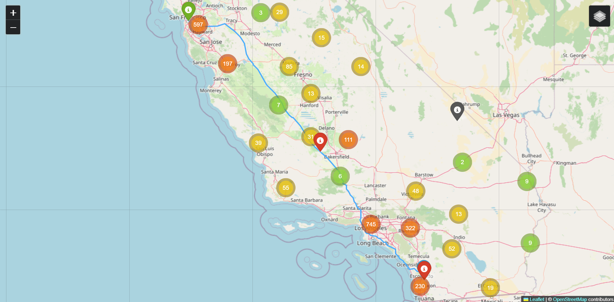

# Optimal Route

Optimal Route is a Python module to find the optimal route between two cities with minimal gas station stops based on the car's fuel efficiency and gas tank volume.

The goal of this project is to demonstrate how ```OpenRouteService``` and ```OverPass``` can be used together for optimal routing and planning for a road trip application. In this scenario, an optimal route will be obtained from ```OpenRouteService``` in terms of pure mileage, then when the tank is depleted past a certain threshold based on average ```mpg```, ```tank_volume```, and ```fos``` a nearest gas station will be picked from the node of depletion to minimize the travel time from the critical path.

Finally, the plotting module ```folium``` is used in order to chart the optimal route from start to finish, display all gas stations in the region, and display the gas stations which were stopped at.

# Instruction
It is necessary to modify ```\optimal_route\routing.py``` with a valid Key from openrouteservice and define the variable ```ORS_API_KEY``` with the valid key.

For an example, please run ```example.py``` and note the arguments used to define the process for obtaining a route between two destinations.

# Example Route


